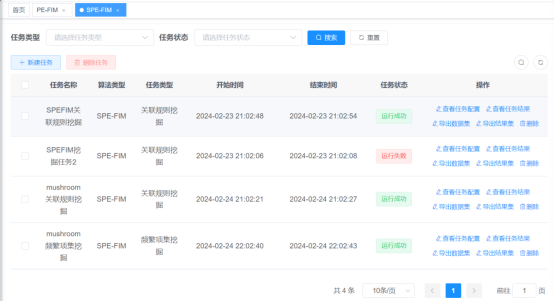
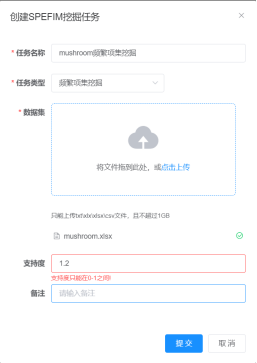

# PEDFIM
Code for paper 《PEDFIM: An Efficient Prefix Encoding-based  Algorithm for Distributed Frequent Itemset Mining》。

前端使用 Vue 构建，后端由 Spring Boot 和 Scala 提供支持。

## 系统架构

1. **前端（Vue.js）**：负责用户界面的呈现和交互。
2. **后端（Spring Boot & Scala）**：负责提供 RESTful API 接口。
3. 配置文件
   项目使用了数据库和其他外部服务如Redis，需要配置相关的连接信息。你可以在后端项目的 application.properties 或 application.yml 文件中进行配置。

## 项目运行步骤

### 1. 前端部分（Vue.js）

#### 安装依赖

首先，确保你已经安装了 Node.js 和 npm。然后在前端目录下执行以下命令来安装依赖：

```bash
cd frontend
npm install
npm run serve
```

### 2. 后端部分
#### 安装依赖
```bash
mvn install
# 启动后端服务
mvn spring-boot:run
```

## 运行截图
启动之后浏览器访问 http://localhost:8080

频繁项集挖掘系统SPE-FIM算法任务管理界面



频繁项集挖掘系统任务创建页面


